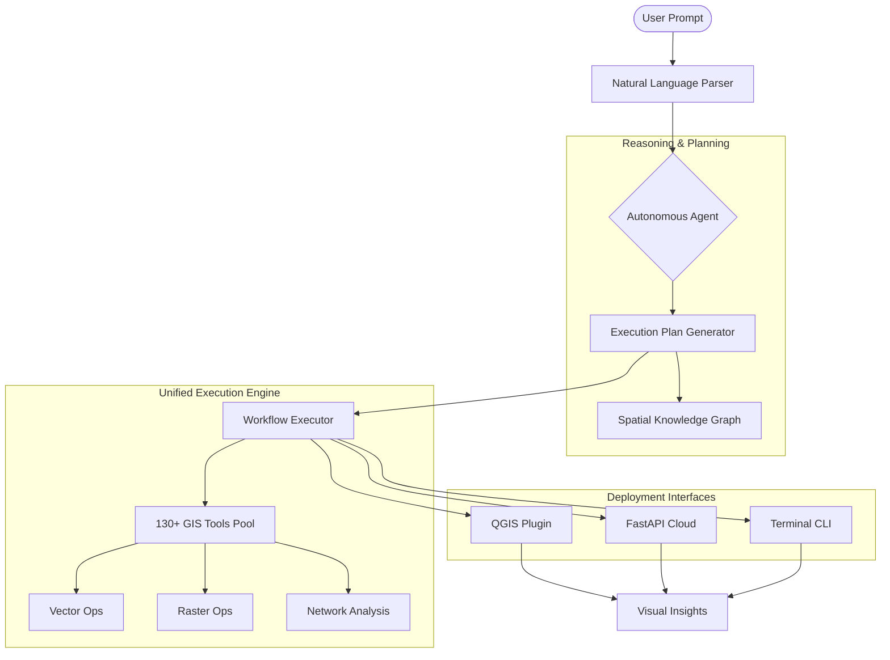

# 🌍 GeoSI: Geospatial Superintelligence

**The Autonomous Intelligence Layer for Professional GIS.**

---

## 🛰️ The Vision
> *"Democratizing Geospatial Intelligence by making complex spatial analysis as simple as natural language."*

GeoSI (Geospatial Superintelligence) is a unified AI orchestration engine designed to bridge the gap between human reasoning and professional GIS execution. It transforms ambiguous natural language prompts into precise, multi-step geospatial workflows, leveraging the full power of QGIS, GDAL, and modern LLMs.

---

## 🏗️ System Architecture

---

## 🚀 Core Pillars

### 1. Autonomous Spatial Reasoning
GeoSI doesn't just run commands; it understands **spatial context**.
- **Intent Detection**: Distinguishes between simple queries and complex analytical requests.
- **Task Decomposition**: Breaks down "Find flood-risk areas near hospitals" into:
    1. Identify hospital locations.
    2. Retrieve flood zone data.
    3. Generate proximity buffers.
    4. Perform spatial intersection.
- **Self-Correction**: Validates geometry and CRS (Coordinate Reference Systems) automatically.

### 2. Unified Engine Strategy
The same core `geosi_engine` powers all interfaces:
- **QGIS Plugin**: Native desktop integration for GIS professionals.
- **Hugging Face / Cloud API**: Scalable REST endpoints for web and mobile apps.
- **Python SDK**: Importable library for data science notebooks and pipelines.
- **CLI**: Scriptable terminal tool for automated GIS tasks.

### 3. Professional Grade Capabilities
- **130+ Tools**: From basic Buffering and Clipping to advanced Terrain Analysis, Carbon Accounting, and NDVI calculation.
- **Multi-Source**: Seamlessly handles Shapefiles, GeoJSON, PostGIS, GeoTIFF, and OGC Web Services.
- **Explainable AI**: Provides a step-by-step reasoning chain for every result generated.

---

## 🛠️ Technology Stack

| Layer | Technologies |
| :--- | :--- |
| **Intelligence** | Claude 3.5, Gemini Pro, GPT-4o, LangChain |
| **GIS Engine** | GeoPandas, Rasterio, Shapely, GDAL/OGR |
| **Backend** | FastAPI, Uvicorn, Pydantic |
| **Desktop** | QGIS Python API (PyQGIS) |
| **Infrastructure** | Docker, PostGIS, Hugging Face Spaces |

---

## 🗺️ Roadmap: The Path to Superintelligence
- [x] **v1.0**: Core engine with basic vector operations.
- [x] **v2.0**: Autonomous Agent integration and QGIS Plugin.
- [ ] **v2.5**: Advanced Raster Analysis & Change Detection.
- [ ] **v3.0**: Real-time Satellite Stream Monitoring & 3D Viewshed Analysis.
- [ ] **v4.0**: Predictive Spatial Modeling & Autonomous Decision Support.

---

## 🤝 Contact & Contribution
**GeoSI** is an open-vision project aimed at pushing the boundaries of AI in Geography.

- **Developer**: AARON R
- **Email**: [aaronr.ds25@duk.ac.in](mailto:aaronr.ds25@duk.ac.in)
- **Repository**: [github.com/aaron43210/GEO_SUPER_INTELLIGENCE](https://github.com/aaron43210/GEO_SUPER_INTELLIGENCE)

---
*© 2026 GeoSI Project. Built for the future of our planet.*
